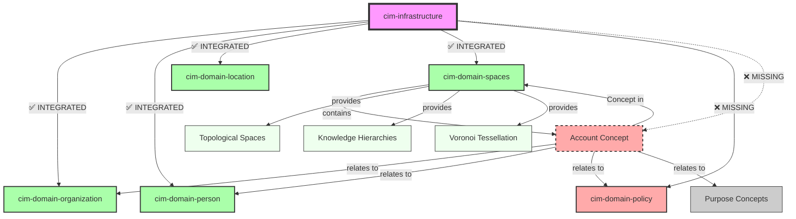

# Domain Alignment Analysis - cim-infrastructure

**Date**: 2026-01-18
**Status**: 🔴 INCOMPLETE - Missing Policy and Account Integration

## Executive Summary

The `cim-infrastructure` module has **partial domain alignment**:
- ✅ **Organization, Person, Location** - Properly integrated
- ❌ **Policy** - Module exists but NOT integrated
- ❌ **Account** - Module exists but NOT integrated (needs special work)

## Current State

### ✅ Properly Aligned Domains

**Dependencies (Cargo.toml:21-23)**:
```toml
cim-domain-organization = { path = "../cim-domain-organization" }
cim-domain-person = { path = "../cim-domain-person" }
cim-domain-location = { path = "../cim-domain-location" }
```

**ComputeResource Fields (compute_resource.rs:63-71)**:
```rust
/// Organization ownership (reference to cim-domain-organization)
pub organization_id: Option<AggregateId>,

/// Physical location (reference to cim-domain-location)
pub location_id: Option<AggregateId>,

/// Primary contact/owner (reference to cim-domain-person)
pub owner_id: Option<AggregateId>,
```

**Relationship Methods**:
- ✅ `set_organization()` - Assign organization ownership
- ✅ `set_location()` - Assign physical location
- ✅ `set_owner()` - Assign primary contact/owner
- ✅ `is_physical()` - Check if resource has location
- ✅ `is_multi_tenant()` - Check if resource has organization

### ❌ Missing: cim-domain-policy Integration

**Current Status**:
- Module exists at v0.8.0 with 156 tests
- Production-ready with NATS JetStream
- **NOT in Cargo.toml dependencies**
- **NO policy fields in ComputeResource**
- **NO policy enforcement methods**

**What Policy Provides**:
- **Policy Types**: Regulatory, Operational, Security, Privacy, Compliance, IT, Safety, Quality, Environmental, Financial, HR
- **Enforcement Levels**: Advisory, Recommended, Mandatory, Critical
- **Policy Scopes**: System, Organization, Department, Project, Team, Individual
- **Lifecycle**: Draft → Approved → Active → Suspended/Revoked → Archived
- **Policy Sets**: Collections of related policies
- **Exemptions**: Temporary exceptions with expiration

**Why Infrastructure Needs Policies**:
1. **Compliance Requirements**: Resources must comply with regulatory policies
2. **Security Controls**: Resources must enforce security policies
3. **Operational Standards**: Resources must follow operational guidelines
4. **Access Control**: Policies determine who can manage resources
5. **Audit Requirements**: Policy compliance must be tracked

### ❌ Missing: Account Concept Integration

**Conceptual Clarification**:
- **Account is a Concept, not a domain aggregate**
- Accounts exist in **cim-domain-spaces** as Concepts
- An account is "an organization for some purpose" - a relationship Concept
- cim-domain-account provides properties/behaviors for account Concepts

**Current Status**:
- cim-domain-spaces already in Cargo.toml ✅
- **NO account_concept_id field in ComputeResource**
- **NO Concept relationship methods**

**What Account Concepts Represent**:
- **Geometric Position**: Location in conceptual space
- **Organization Relationship**: Links to organization concepts
- **Purpose Relationship**: Links to purpose/goal concepts
- **Knowledge Level**: Unknown → Suspected → KnownUnknown → Known
- **Evidence**: CIDs supporting the account concept
- **Multi-dimensional**: Quality dimensions define account properties

**Account as Concept Properties** (from cim-domain-account):
- **Lifecycle States**: Pending → Active → Suspended → Closed → Archived
- **Account Types**: Personal, Business, Enterprise, System, Custom
- **Service Tiers**: Free, Basic, Professional, Enterprise, Custom
- **Multi-Tenancy**: Concepts can relate to multiple organization concepts
- **Conceptual Relationships**:
  - Organization concepts (via ConceptRelationship)
  - Person concepts (users)
  - Purpose concepts (goals)
  - Location concepts (jurisdiction)
  - Policy concepts (authorization rules)

**Why Infrastructure Needs Account Concepts** (Conceptual Space Integration):

1. **Conceptual Positioning**:
   - Resources exist in conceptual space relative to account concepts
   - Account concept position determines semantic meaning
   - Conceptual distance = similarity/relevance

2. **Semantic Relationships**:
   - Resources relate to account concepts via ConceptRelationship
   - Relationship strength (0.0-1.0) indicates association level
   - Relationship types: Belongs-To, Managed-By, Billed-To, Custom

3. **Multi-Tenancy via Concept Networks**:
   - Resources can relate to multiple account concepts
   - Each relationship has independent strength and properties
   - Network structure determines access patterns

4. **Authorization via Policy Concepts**:
   - Account concepts relate to policy concepts
   - Policy concepts define authorization rules
   - Transitive relationships: Resource → Account → Policy

5. **Knowledge & Evidence**:
   - Account concept knowledge_level indicates certainty
   - Evidence CIDs prove account legitimacy
   - Confidence scores guide authorization decisions

**Concept-Based Integration Pattern**:
```rust
// Infrastructure references account Concepts (not domain aggregates):

1. Track account concept reference:
   /// Account concept from cim-domain-spaces
   /// Represents "organization for purpose" relationship
   pub account_concept_id: Option<ConceptId>,

2. Query conceptual space for relationships:
   async fn get_account_concept(&self) -> Option<Concept> {
       // Query cim-domain-spaces for the Concept
       // Returns Concept with relationships, properties, knowledge level
   }

3. Check concept state via properties:
   fn validate_account_concept(&self, concept: &Concept) -> Result<()> {
       // Account state stored in concept.properties
       let state = concept.properties.get("account_state")?;
       match state {
           "Active" => Ok(()),
           "Suspended" => Err(Error::AccountSuspended),
           _ => Err(Error::AccountInactive),
       }
   }

4. Navigate concept relationships:
   fn get_authorized_users(&self, concept: &Concept) -> Vec<PersonId> {
       // Follow ConceptRelationships to Person concepts
       concept.relationships
           .iter()
           .filter(|r| r.relationship_type == RelationshipType::Custom("authorized_user".into()))
           .map(|r| r.to_concept)
           .collect()
   }

5. Emit events with conceptual context:
   ResourceEvent {
       resource_id: self.id,
       account_concept_id: self.account_concept_id,
       conceptual_context: ConceptualContext {
           position: concept.position,
           knowledge_level: concept.knowledge_level,
           related_concepts: concept.relationships,
       },
       // ...
   }
```

## Required Changes

### Phase 1: Add Dependencies

**File**: `Cargo.toml`
```toml
# Add line 24:
cim-domain-policy = { path = "../cim-domain-policy" }

# Note: cim-domain-spaces already present (line 20) ✅
# Note: cim-domain-account provides account Concept properties, not direct integration
```

### Phase 2: Add Policy Integration

**File**: `src/domain/compute_resource.rs`

**Add field (after line 91)**:
```rust
/// Applicable policies (reference to cim-domain-policy)
/// Infrastructure resources can have multiple policies applied:
/// - Security policies (mandatory encryption, access controls)
/// - Compliance policies (regulatory requirements)
/// - Operational policies (backup schedules, maintenance windows)
#[serde(skip_serializing_if = "Vec::is_empty", default)]
pub policy_ids: Vec<AggregateId>,
```

**Add methods**:
```rust
/// Add a policy to this resource
///
/// # Invariant
/// - Policy ID must reference valid cim-domain-policy aggregate
/// - Duplicate policies are ignored (idempotent)
pub fn add_policy(&mut self, policy_id: AggregateId) {
    if !self.policy_ids.contains(&policy_id) {
        self.policy_ids.push(policy_id);
        self.updated_at = Utc::now();
    }
}

/// Remove a policy from this resource
pub fn remove_policy(&mut self, policy_id: &AggregateId) -> bool {
    if let Some(pos) = self.policy_ids.iter().position(|id| id == policy_id) {
        self.policy_ids.remove(pos);
        self.updated_at = Utc::now();
        true
    } else {
        false
    }
}

/// Get all applicable policies
pub fn get_applicable_policies(&self) -> &[AggregateId] {
    &self.policy_ids
}

/// Check if resource has a specific policy applied
pub fn has_policy(&self, policy_id: &AggregateId) -> bool {
    self.policy_ids.contains(policy_id)
}
```

### Phase 3: Add Account Concept Integration

**File**: `src/domain/compute_resource.rs`

**Add ConceptId import**:
```rust
use cim_domain_spaces::ConceptId;
```

**Add field (after policy_ids)**:
```rust
/// Account concept (reference to cim-domain-spaces Concept)
/// Represents "organization for purpose" relationship in conceptual space
///
/// **Invariant**: If set, concept must exist in conceptual space
/// **Conceptual Semantics**:
/// - Account concept position determines semantic meaning
/// - Concept relationships define authorization (→ Person concepts, → Policy concepts)
/// - Concept properties contain account state (Active, Suspended, etc.)
/// - Knowledge level indicates certainty about account
#[serde(skip_serializing_if = "Option::is_none")]
pub account_concept_id: Option<ConceptId>,
```

**Add account concept methods**:
```rust
/// Associate resource with account concept
///
/// # Invariant
/// - Concept must exist in cim-domain-spaces
/// - Concept must have account properties (type, state, tier)
pub fn set_account_concept(
    &mut self,
    concept_id: ConceptId,
) -> Result<(), ComputeResourceError> {
    // Store reference to account concept
    self.account_concept_id = Some(concept_id);
    self.updated_at = Utc::now();
    Ok(())
}

/// Remove account concept association
pub fn clear_account_concept(&mut self) {
    self.account_concept_id = None;
    self.updated_at = Utc::now();
}

/// Check if resource is concept-managed (has account concept)
pub fn is_concept_managed(&self) -> bool {
    self.account_concept_id.is_some()
}

/// Get account concept ID for conceptual space queries
pub fn get_account_concept(&self) -> Option<ConceptId> {
    self.account_concept_id
}
```

**Add to error enum**:
```rust
#[error("No account concept - resource must be associated with account concept")]
NoAccountConcept,

#[error("Account concept not found in conceptual space: {0}")]
AccountConceptNotFound(String),

#[error("Account concept invalid: {0}")]
InvalidAccountConcept(String),
```

**Note**: Concept state validation happens at the service layer by querying cim-domain-spaces,
not in the ComputeResource domain entity itself.

### Phase 4: Integration Testing

**File**: `tests/domain_alignment_tests.rs` (NEW)

```rust
// Copyright (c) 2025 - Cowboy AI, Inc.
//! Domain Alignment Tests
//!
//! Verifies that cim-infrastructure properly integrates with:
//! - cim-domain-organization
//! - cim-domain-person
//! - cim-domain-location
//! - cim-domain-policy
//! - cim-domain-account

use anyhow::Result;
use cim_domain::AggregateId;
use cim_infrastructure::{ComputeResource, Hostname, ResourceType};
use uuid::Uuid;

#[test]
fn test_organization_person_location_alignment() -> Result<()> {
    // Create resource
    let hostname = Hostname::new("test-server01")?;
    let mut resource = ComputeResource::new(hostname, ResourceType::PhysicalServer)?;

    // Add organization
    let org_id = AggregateId::new();
    resource.set_organization(org_id);
    assert_eq!(resource.organization_id, Some(org_id));
    assert!(resource.is_multi_tenant());

    // Add location
    let location_id = AggregateId::new();
    resource.set_location(location_id);
    assert_eq!(resource.location_id, Some(location_id));
    assert!(resource.is_physical());

    // Add owner
    let owner_id = AggregateId::new();
    resource.set_owner(owner_id);
    assert_eq!(resource.owner_id, Some(owner_id));

    Ok(())
}

#[test]
fn test_policy_alignment() -> Result<()> {
    let hostname = Hostname::new("secure-server01")?;
    let mut resource = ComputeResource::new(hostname, ResourceType::PhysicalServer)?;

    // Add security policy
    let security_policy = AggregateId::new();
    resource.add_policy(security_policy);
    assert!(resource.has_policy(&security_policy));

    // Add compliance policy
    let compliance_policy = AggregateId::new();
    resource.add_policy(compliance_policy);
    assert_eq!(resource.get_applicable_policies().len(), 2);

    // Remove policy
    assert!(resource.remove_policy(&security_policy));
    assert!(!resource.has_policy(&security_policy));
    assert_eq!(resource.get_applicable_policies().len(), 1);

    // Idempotent add
    resource.add_policy(compliance_policy);
    assert_eq!(resource.get_applicable_policies().len(), 1);

    Ok(())
}

#[test]
fn test_account_concept_alignment() -> Result<()> {
    use cim_domain_spaces::ConceptId;

    let hostname = Hostname::new("concept-managed-server")?;
    let mut resource = ComputeResource::new(hostname, ResourceType::PhysicalServer)?;

    // Initially no account concept
    assert!(!resource.is_concept_managed());

    // Associate with account concept
    let account_concept_id = ConceptId::new();
    resource.set_account_concept(account_concept_id)?;

    assert!(resource.is_concept_managed());
    assert_eq!(resource.get_account_concept(), Some(account_concept_id));

    // Clear concept association
    resource.clear_account_concept();
    assert!(!resource.is_concept_managed());

    Ok(())
}

#[test]
fn test_full_domain_integration() -> Result<()> {
    use cim_domain_spaces::ConceptId;

    // Create fully-integrated resource
    let hostname = Hostname::new("production-server01")?;
    let mut resource = ComputeResource::new(hostname, ResourceType::PhysicalServer)?;

    // Organization + Location + Owner (Domain Aggregates)
    resource.set_organization(AggregateId::new());
    resource.set_location(AggregateId::new());
    resource.set_owner(AggregateId::new());

    // Account Concept (Conceptual Space)
    resource.set_account_concept(ConceptId::new())?;

    // Policies (Domain Aggregates)
    resource.add_policy(AggregateId::new()); // Security
    resource.add_policy(AggregateId::new()); // Compliance
    resource.add_policy(AggregateId::new()); // Operational

    // Metadata
    resource.add_metadata("rack", "dc1_rack42")?;
    resource.add_metadata("role", "database_server")?;

    // Hardware
    resource.set_hardware(
        Some("Dell".to_string()),
        Some("PowerEdge R740".to_string()),
        Some("SN123456".to_string()),
    );

    // Verify all relationships
    assert!(resource.is_multi_tenant());          // Has organization
    assert!(resource.is_physical());              // Has location
    assert!(resource.is_concept_managed());       // Has account concept
    assert_eq!(resource.get_applicable_policies().len(), 3);
    assert_eq!(resource.metadata.len(), 2);
    assert!(resource.manufacturer.is_some());

    Ok(())
}
```

## Domain Relationship Diagram

```
┌────────────────────────────────────────────────────────────────────┐
│                    ComputeResource Aggregate                       │
│                                                                     │
│  Core Fields:                                                       │
│  - id: AggregateId (UUID v7)                                       │
│  - hostname: Hostname (RFC 1123)                                   │
│  - resource_type: ResourceType (35 types)                          │
│                                                                     │
│  Domain Relationships (Aggregates):                                 │
│  ┌──────────────────────────────────────────────────────────────┐ │
│  │ ✅ organization_id → cim-domain-organization                 │ │
│  │    (Multi-tenant ownership - Domain Aggregate)                │ │
│  │                                                                │ │
│  │ ✅ location_id → cim-domain-location                         │ │
│  │    (Physical placement - Domain Aggregate)                    │ │
│  │                                                                │ │
│  │ ✅ owner_id → cim-domain-person                              │ │
│  │    (Primary contact/responsible person - Domain Aggregate)    │ │
│  │                                                                │ │
│  │ ❌ policy_ids → cim-domain-policy (MISSING)                  │ │
│  │    (Compliance, security, operational policies - Aggregates)  │ │
│  └──────────────────────────────────────────────────────────────┘ │
│                                                                     │
│  Conceptual Space Relationships:                                    │
│  ┌──────────────────────────────────────────────────────────────┐ │
│  │ ❌ account_concept_id → cim-domain-spaces::ConceptId (MISS) │ │
│  │    (Account as Concept - "organization for purpose")          │ │
│  │                                                                │ │
│  │    Account Concept Properties (in conceptual space):          │ │
│  │    - position: Point3<f64> (geometric location)               │ │
│  │    - knowledge_level: KnowledgeLevel (certainty)              │ │
│  │    - relationships: Vec<ConceptRelationship>                  │ │
│  │      ├── → Organization concepts (belongs-to)                 │ │
│  │      ├── → Person concepts (authorized users)                 │ │
│  │      ├── → Policy concepts (authorization rules)              │ │
│  │      └── → Purpose concepts (why account exists)              │ │
│  │    - properties: HashMap (account state, type, tier)          │ │
│  │    - evidence_cids: Vec<String> (proof/verification)          │ │
│  │    - confidence: f64 (0.0-1.0)                                │ │
│  └──────────────────────────────────────────────────────────────┘ │
│                                                                     │
│  Hardware & Metadata:                                               │
│  - manufacturer, model, serial_number                               │
│  - metadata: HashMap<String, String>                                │
│  - created_at, updated_at                                           │
└────────────────────────────────────────────────────────────────────┘
```

## Dependency Graph



**Legend**:
- Solid arrows: Direct module dependencies
- Dashed arrows: Conceptual relationships (via cim-domain-spaces)
- Green: Properly integrated
- Red: Missing integration
- Dashed red: Account Concept (not a module, but a Concept in spaces)

## Implementation Priority

### 🔴 HIGH Priority - Policy Integration
**Impact**: Compliance, security, operational governance
**Complexity**: Medium
**Blocking**: Security audits, compliance certification
**Estimated Effort**: 4 hours
**Type**: Domain Aggregate Integration

### 🔴 HIGH Priority - Account Concept Integration
**Impact**: Billing, authorization, multi-tenancy via conceptual space
**Complexity**: Medium (Concept reference, not full state management)
**Blocking**: Semantic resource management, conceptual queries
**Estimated Effort**: 3 hours (simpler than aggregate - just reference)
**Type**: Conceptual Space Integration

**Note**: Account Concepts are managed by cim-domain-spaces, not cim-infrastructure.
Infrastructure only stores ConceptId references and queries conceptual space as needed.

## Success Criteria

### Policy Integration Complete
- ✅ cim-domain-policy in Cargo.toml
- ✅ policy_ids field in ComputeResource
- ✅ Policy management methods (add/remove/query)
- ✅ Policy builder pattern support
- ✅ Policy tests passing

### Account Concept Integration Complete
- ✅ cim-domain-spaces already in Cargo.toml
- ✅ account_concept_id field in ComputeResource (ConceptId)
- ✅ Concept association methods (set/clear/get)
- ✅ Concept-managed resource checks
- ✅ Account concept tests passing
- ✅ Account concept error types defined
- ✅ Documentation of Concept-based architecture

**Note**: Account state validation happens at service layer via conceptual space queries,
not in domain entity. This follows proper separation of concerns.

### Full Domain Alignment
- ✅ All 4 domain aggregates properly integrated (org, person, location, policy)
- ✅ Conceptual space integration (account concepts)
- ✅ Complete relationship diagram showing both aggregate and concept relationships
- ✅ Full integration test suite covering domains and concepts
- ✅ Documentation updated with Concept-based architecture
- ✅ All invariants documented and tested
- ✅ Clear separation between domain aggregates and conceptual space

## Key Insights: Domain Aggregates vs. Concepts

### Domain Aggregates (Reference by AggregateId)
- **Organization**: Business entity aggregate
- **Person**: Individual identity aggregate
- **Location**: Physical place aggregate
- **Policy**: Authorization rule aggregate

These are traditional DDD aggregates with:
- Independent lifecycle
- Event sourcing
- Aggregate roots
- Business invariants

### Concepts (Reference by ConceptId)
- **Account**: "organization for purpose" relationship
- **Purpose**: Goals and intentions
- **Other semantic concepts**: Categories, classifications, meanings

These exist in conceptual space with:
- Geometric positioning
- Conceptual relationships (via ConceptRelationship)
- Knowledge levels (Unknown → Known)
- Evidence and confidence
- Managed by cim-domain-spaces

### Integration Pattern
```rust
// Domain aggregates: Direct references
pub organization_id: Option<AggregateId>,  // ← Domain aggregate
pub person_id: Option<AggregateId>,        // ← Domain aggregate

// Concepts: References to conceptual space
pub account_concept_id: Option<ConceptId>, // ← Concept in spaces

// Query pattern:
// 1. Get ConceptId from resource
// 2. Query cim-domain-spaces for full Concept
// 3. Navigate ConceptRelationships to related concepts
// 4. Check concept.properties for state/config
```

## References

- **CIM Alignment Plan**: [CIM_ALIGNMENT_PLAN.md](./CIM_ALIGNMENT_PLAN.md) (lines 377-401)
- **Policy Domain**: `/git/thecowboyai/cim-domain-policy` (v0.8.0, production-ready)
- **Spaces Domain**: `/git/thecowboyai/cim-domain-spaces` (v0.9.7, 167 tests, 95%+ coverage)
- **Account as Concept**: `/git/thecowboyai/cim-domain-account` (provides account concept properties)
- **Value Objects**: [docs/DOMAIN_VALUE_OBJECTS.md](./docs/DOMAIN_VALUE_OBJECTS.md)
- **Gärdenfors Theory**: Conceptual Spaces - The Geometry of Thought (2000)

---

**Created**: 2026-01-18
**Updated**: 2026-01-18 (Corrected to Concept-based architecture)
**Status**: 🔴 INCOMPLETE - Missing Policy integration and Account Concept reference
**Next Steps**: Implement Phase 1-3 changes above
**Key Change**: Account is a Concept, not a domain aggregate
