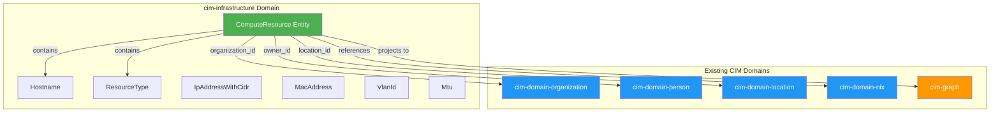

# Infrastructure Domain Value Objects & Entities

**Value objects with validation invariants that compose with existing CIM domains**

## Overview

The infrastructure domain models follow DDD principles with:
- **Value Objects** with validation invariants
- **Entities** that compose with existing CIM domains via `AggregateId` references
- **Proper serialization** for events and projections
- **Type safety** through Rust's type system

## Domain Composition



## Value Objects

### 1. Hostname

**File**: `src/domain/hostname.rs`

**Purpose**: DNS-validated FQDN with RFC 1123 compliance

**Invariants**:
- Non-empty
- Total length ≤ 253 characters
- Each label ≤ 63 characters
- Labels contain only alphanumeric + hyphen
- Labels cannot start/end with hyphen
- TLD cannot be all numeric

**Usage**:
```rust
use cim_infrastructure::Hostname;

// Valid
let host = Hostname::new("web01.prod.example.com")?;
assert_eq!(host.short_name(), "web01");
assert_eq!(host.domain(), Some("prod.example.com"));
assert!(host.is_fqdn());

// Invalid
assert!(Hostname::new("").is_err());  // Empty
assert!(Hostname::new("-invalid").is_err());  // Starts with hyphen
```

### 2. IpAddressWithCidr

**File**: `src/domain/network.rs`

**Purpose**: IPv4/IPv6 address with optional CIDR notation

**Invariants**:
- Valid IP address format
- Prefix length 0-32 for IPv4, 0-128 for IPv6

**Usage**:
```rust
use cim_infrastructure::IpAddressWithCidr;

let ip = IpAddressWithCidr::new("192.168.1.10/24")?;
assert_eq!(ip.prefix_length(), Some(24));
assert!(ip.is_ipv4());
assert_eq!(ip.as_cidr(), "192.168.1.10/24");

// IPv6
let ipv6 = IpAddressWithCidr::new("2001:db8::1/64")?;
assert!(ipv6.is_ipv6());
```

### 3. MacAddress

**File**: `src/domain/network.rs`

**Purpose**: 48-bit MAC address with validation

**Invariants**:
- Valid MAC address format (6 octets)
- Canonical representation (lowercase, colon-separated)

**Usage**:
```rust
use cim_infrastructure::MacAddress;

let mac = MacAddress::new("00:11:22:33:44:55")?;
assert_eq!(mac.as_str(), "00:11:22:33:44:55");
assert!(mac.is_unicast());
assert!(!mac.is_multicast());

// Also accepts different formats
let mac2 = MacAddress::new("00-11-22-33-44-55")?;  // Dash-separated
let mac3 = MacAddress::new("001122334455")?;  // No separator
```

### 4. VlanId

**File**: `src/domain/network.rs`

**Purpose**: IEEE 802.1Q VLAN ID validation

**Invariants**:
- VLAN ID must be 1-4094
- 0 and 4095 are reserved

**Usage**:
```rust
use cim_infrastructure::VlanId;

let vlan = VlanId::new(100)?;
assert_eq!(vlan.value(), 100);

// Invalid
assert!(VlanId::new(0).is_err());  // Reserved
assert!(VlanId::new(4095).is_err());  // Reserved
assert!(VlanId::new(5000).is_err());  // Out of range
```

### 5. Mtu

**File**: `src/domain/network.rs`

**Purpose**: Maximum Transmission Unit validation

**Invariants**:
- MTU must be 68-9000 bytes
- 68 = minimum IPv4 MTU
- 9000 = jumbo frames

**Usage**:
```rust
use cim_infrastructure::Mtu;

let mtu = Mtu::new(1500)?;
assert!(mtu.is_standard_ethernet());
assert!(!mtu.is_jumbo());

let jumbo = Mtu::new(9000)?;
assert!(jumbo.is_jumbo());

// Invalid
assert!(Mtu::new(67).is_err());  // Too small
assert!(Mtu::new(10000).is_err());  // Too large
```

### 6. ResourceType

**File**: `src/domain/resource_type.rs`

**Purpose**: Infrastructure resource taxonomy (32 types, 9 categories)

**Invariants**:
- Each type has unique canonical string
- Each type belongs to exactly one category
- Color derived from category
- Alias resolution to canonical form

**Usage**:
```rust
use cim_infrastructure::ResourceType;

let rt = ResourceType::from_str("router");
assert_eq!(rt.display_name(), "Router");
assert_eq!(rt.category(), ResourceCategory::Network);
assert_eq!(rt.netbox_color(), "2196f3");
assert!(rt.is_network_device());

// With aliases
let l3 = ResourceType::from_str("l3_switch");
assert_eq!(l3, ResourceType::Layer3Switch);
```

## Entities

### ComputeResource

**File**: `src/domain/compute_resource.rs`

**Purpose**: Computational infrastructure resource with domain composition

**Invariants**:
- Must have valid hostname
- Must have resource type
- Physical resources should have location
- Multi-tenant resources should have organization
- Metadata keys must be lowercase alphanumeric + underscore

**Domain References**:
- `organization_id: Option<AggregateId>` → cim-domain-organization
- `owner_id: Option<AggregateId>` → cim-domain-person
- `location_id: Option<AggregateId>` → cim-domain-location
- Can reference NixOS topology via AggregateId (avoiding circular dependency)

**Usage**:
```rust
use cim_infrastructure::{ComputeResource, Hostname, ResourceType};
use cim_domain::AggregateId;

// Simple creation
let hostname = Hostname::new("web01.prod.example.com")?;
let resource = ComputeResource::new(hostname, ResourceType::PhysicalServer)?;

// Builder pattern with domain composition
let hostname = Hostname::new("router01.dc1.example.com")?;
let org_id = AggregateId::new();  // References Organization aggregate
let location_id = AggregateId::new();  // References Location aggregate
let owner_id = AggregateId::new();  // References Person aggregate

let resource = ComputeResource::builder(hostname, ResourceType::Router)?
    .organization(org_id)
    .location(location_id)
    .owner(owner_id)
    .hardware("Cisco", "ASR 1001-X")
    .serial_number("ABC123")
    .asset_tag("IT-001")
    .metadata("rack", "A01")?
    .metadata("row", "1")?
    .build()?;

// Check relationships
assert!(resource.is_physical());  // Has location
assert!(resource.is_multi_tenant());  // Has organization
```

**Serialization**:
```json
{
  "id": "01936194-0000-7000-8000-000000000001",
  "hostname": "router01.dc1.example.com",
  "resource_type": "router",
  "organization_id": "01936194-0000-7000-8000-000000000002",
  "location_id": "01936194-0000-7000-8000-000000000003",
  "owner_id": "01936194-0000-7000-8000-000000000004",
  "manufacturer": "Cisco",
  "model": "ASR 1001-X",
  "serial_number": "ABC123",
  "asset_tag": "IT-001",
  "metadata": {
    "rack": "A01",
    "row": "1"
  },
  "created_at": "2026-01-18T12:00:00Z",
  "updated_at": "2026-01-18T12:00:00Z"
}
```

## Domain Relationships

### Organization Ownership

```rust
// Create organization reference
let org_id = AggregateId::new();  // From cim-domain-organization

// Assign to resource
resource.set_organization(org_id);

// Query
if resource.is_multi_tenant() {
    println!("Resource owned by organization: {:?}", resource.organization_id);
}
```

### Physical Location

```rust
// Create location reference
let location_id = AggregateId::new();  // From cim-domain-location

// Assign to resource
resource.set_location(location_id);

// Query
if resource.is_physical() {
    println!("Resource located at: {:?}", resource.location_id);
}
```

### Owner/Contact

```rust
// Create person reference
let owner_id = AggregateId::new();  // From cim-domain-person

// Assign to resource
resource.set_owner(owner_id);

// Query
if let Some(owner) = resource.owner_id {
    println!("Resource owner: {:?}", owner);
}
```

### NixOS Topology

```rust
// Reference NixOS topology node via metadata
resource.add_metadata("nixos_node_id", nixos_node_aggregate_id.to_string())?;

// Or create a dedicated field (avoiding circular dependency):
// topology_node_id: Option<AggregateId>
```

## Validation Policies

All value objects enforce validation at construction time:

```rust
// This will fail at compile time or return Result<T, Error>
let invalid_hostname = Hostname::new("invalid..hostname")?;  // Error!
let invalid_ip = IpAddressWithCidr::new("999.999.999.999")?;  // Error!
let invalid_mac = MacAddress::new("invalid")?;  // Error!
let invalid_vlan = VlanId::new(5000)?;  // Error!

// Metadata validation
resource.add_metadata("Invalid-Key", "value")?;  // Error! Must be lowercase
resource.add_metadata("valid_key", "value")?;  // OK
```

## Event Serialization

All types implement `Serialize`/`Deserialize` for event sourcing:

```rust
use serde_json;

let resource = ComputeResource::builder(hostname, ResourceType::Router)?
    .organization(org_id)
    .build()?;

// Serialize to JSON (for events)
let json = serde_json::to_string(&resource)?;

// Deserialize from JSON
let resource: ComputeResource = serde_json::from_str(&json)?;
```

## Graph Integration

ComputeResource can be projected to cim-graph:

```rust
// Project to graph node
let node = GraphNode {
    id: resource.id,
    labels: vec!["Infrastructure", "ComputeResource", resource.resource_type.as_str()],
    properties: serde_json::to_value(&resource)?,
};

// Create relationships
if let Some(org_id) = resource.organization_id {
    create_relationship(resource.id, "OWNED_BY", org_id)?;
}

if let Some(location_id) = resource.location_id {
    create_relationship(resource.id, "LOCATED_AT", location_id)?;
}

if let Some(owner_id) = resource.owner_id {
    create_relationship(resource.id, "MANAGED_BY", owner_id)?;
}
```

## Testing

All value objects include comprehensive tests:

```bash
# Test value object validation
cargo test --lib domain::hostname::tests
cargo test --lib domain::network::tests
cargo test --lib domain::compute_resource::tests

# All domain tests
cargo test --lib domain::
```

## Benefits

1. **Type Safety**: Invalid data rejected at compile time or construction
2. **Domain Composition**: Clean references to existing CIM domains
3. **No Circular Dependencies**: Using AggregateId references, not direct dependencies
4. **Event Sourcing Ready**: All types serialize to events
5. **Graph Ready**: Can project to cim-graph with relationships
6. **Validation Invariants**: Business rules enforced at domain level
7. **Ubiquitous Language**: Types match infrastructure terminology

## Next Steps

1. Create NetworkSegment entity (IPAM)
2. Create Interface entity (network interfaces)
3. Create Cable entity (physical connections)
4. Update NetBox adapter to use domain entities
5. Add event sourcing projections
6. Integrate with cim-graph for topology
