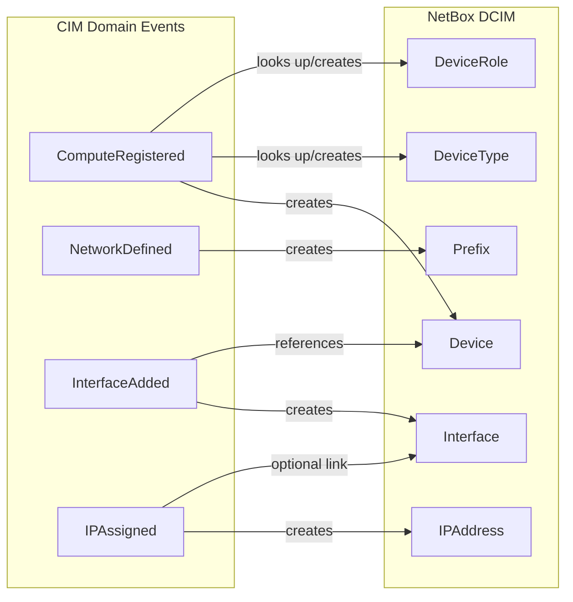
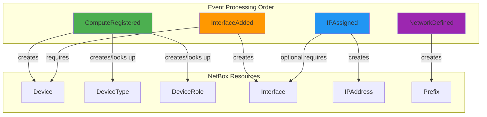

# NetBox Domain Mapping

**Complete mapping between CIM Infrastructure Domain Events and NetBox API**

This document details how our domain events are projected (via Category Theory Functor) into NetBox DCIM models.

## Architecture Overview

```
F: InfrastructureEvents → NetBox DCIM
where F is a Functor preserving category structure

F(ComputeRegistered)    = POST /api/dcim/devices/
F(NetworkDefined)       = POST /api/ipam/prefixes/
F(InterfaceAdded)       = POST /api/dcim/interfaces/
F(IPAssigned)           = POST /api/ipam/ip-addresses/
```

## Data Model Overview



---

## 1. ComputeRegistered → NetBox Device

### Domain Event Schema

```json
{
  "event_id": "01936194-...",
  "aggregate_id": "01936194-...",
  "event_type": "ComputeRegistered",
  "data": {
    "id": "server-1",
    "hostname": "web01.example.com",      // REQUIRED
    "resource_type": "physical_server",   // REQUIRED (maps to device role)
    "manufacturer": "Dell",               // Optional (default: "Generic")
    "model": "PowerEdge R750",            // Optional (default: "Generic Server")
    "serial_number": "ABC123",            // Optional
    "asset_tag": "IT-001"                 // Optional
  }
}
```

### NetBox API Model

**Endpoint**: `POST /api/dcim/devices/`

```rust
NetBoxDevice {
    id: None,                              // Auto-assigned by NetBox
    name: String,                          // From event.data.hostname
    device_type: i32,                      // Looked up/created from manufacturer + model
    device_role: i32,                      // Looked up/created from resource_type
    site: i32,                             // From config.default_site_id
    status: Some("active"),                // Fixed value
    comments: Some(String),                // Generated: "Created from CIM event - type: {resource_type}"
    custom_fields: Some({                  // Stores correlation back to domain
        "cim_aggregate_id": event.data.id
    })
}
```

### Mapping Logic

```rust
// Location: src/adapters/netbox.rs:346-400

async fn project_compute_registered(&self, data: &Value) -> Result<()> {
    // 1. Extract required fields
    let hostname = data["hostname"].as_str().required()?;

    // 2. Check idempotency (prevent duplicates)
    if self.device_exists(hostname).await?.is_some() {
        return Ok(()); // Already exists, skip
    }

    // 3. Extract optional fields with defaults
    let resource_type = data["resource_type"].as_str().unwrap_or("server");
    let manufacturer = data["manufacturer"].as_str().unwrap_or("Generic");
    let model = data["model"].as_str().unwrap_or("Generic Server");

    // 4. Resolve dependencies (auto-create if needed)
    let device_type_id = self.get_or_create_device_type(manufacturer, model).await?;
    let device_role_id = self.get_or_create_device_role(resource_type).await?;

    // 5. Build NetBox model
    let device = NetBoxDevice {
        name: hostname.to_string(),
        device_type: device_type_id,
        device_role: device_role_id,
        site: self.config.default_site_id.unwrap_or(1),
        status: Some("active".to_string()),
        comments: Some(format!("Created from CIM event - type: {}", resource_type)),
        custom_fields: Some(json!({"cim_aggregate_id": data["id"]})),
        ..Default::default()
    };

    // 6. POST to NetBox API
    let response = self.client
        .post("/api/dcim/devices/")
        .json(&device)
        .send().await?;

    // 7. Handle response
    if response.status() == CREATED || response.status() == OK {
        Ok(())
    } else {
        Err(ProjectionError::DatabaseError(response.text().await?))
    }
}
```

### Field Mapping Table

| Domain Event Field | NetBox Field | Type | Notes |
|-------------------|--------------|------|-------|
| `data.hostname` | `name` | String | REQUIRED, must be unique |
| `data.resource_type` | `device_role` (id) | i32 | Looked up via `get_or_create_device_role()` |
| `data.manufacturer` | `device_type.manufacturer` | i32 | Looked up via `get_or_create_device_type()` |
| `data.model` | `device_type.model` | i32 | Looked up via `get_or_create_device_type()` |
| `config.default_site_id` | `site` | i32 | From adapter config |
| `data.id` | `custom_fields.cim_aggregate_id` | String | Domain correlation |
| - | `status` | String | Fixed: "active" |

### Dependency Resolution

**Device Type** (manufacturer + model):
```rust
// GET /api/dcim/device-types/?model={model}
// If not found: POST /api/dcim/device-types/
{
    "manufacturer": {"name": "Dell", "slug": "dell"},
    "model": "PowerEdge R750",
    "slug": "poweredge-r750"
}
```

**Device Role** (resource_type):
```rust
// GET /api/dcim/device-roles/?name={resource_type}
// If not found: POST /api/dcim/device-roles/
{
    "name": "physical_server",
    "slug": "physical-server",
    "color": "2196f3"
}
```

---

## 2. NetworkDefined → NetBox Prefix

### Domain Event Schema

```json
{
  "event_id": "01936194-...",
  "aggregate_id": "01936194-...",
  "event_type": "NetworkDefined",
  "data": {
    "id": "network-1",
    "name": "DMZ Network",          // Optional
    "cidr": "192.168.100.0/24",     // REQUIRED
    "vlan_id": 100,                 // Optional
    "description": "DMZ segment"    // Optional
  }
}
```

### NetBox API Model

**Endpoint**: `POST /api/ipam/prefixes/`

```rust
NetBoxPrefix {
    id: None,                         // Auto-assigned by NetBox
    prefix: String,                   // From event.data.cidr (CIDR format)
    site: Option<i32>,                // From config.default_site_id
    status: Some("active"),           // Fixed value
    description: Some(String)         // Generated: "CIM Network: {name}"
}
```

### Mapping Logic

```rust
// Location: src/adapters/netbox.rs:402-462

async fn project_network_defined(&self, data: &Value) -> Result<()> {
    // 1. Extract required fields
    let cidr = data["cidr"].as_str().required()?;
    let name = data["name"].as_str().unwrap_or("unnamed");

    // 2. Check idempotency
    let search_url = format!("/api/ipam/prefixes/?prefix={}",
                              urlencoding::encode(cidr));
    if prefix_exists(&search_url).await? {
        return Ok(()); // Already exists
    }

    // 3. Build NetBox model
    let prefix = NetBoxPrefix {
        prefix: cidr.to_string(),
        site: self.config.default_site_id,
        status: Some("active".to_string()),
        description: Some(format!("CIM Network: {}", name)),
        ..Default::default()
    };

    // 4. POST to NetBox API
    self.client
        .post("/api/ipam/prefixes/")
        .json(&prefix)
        .send().await?;

    Ok(())
}
```

### Field Mapping Table

| Domain Event Field | NetBox Field | Type | Notes |
|-------------------|--------------|------|-------|
| `data.cidr` | `prefix` | String | REQUIRED, CIDR format (e.g., "10.0.0.0/24") |
| `data.name` | `description` | String | Optional, prefixed with "CIM Network: " |
| `config.default_site_id` | `site` | i32 | From adapter config |
| - | `status` | String | Fixed: "active" |

---

## 3. InterfaceAdded → NetBox Interface

### Domain Event Schema

```json
{
  "event_id": "01936194-...",
  "aggregate_id": "01936194-...",
  "event_type": "InterfaceAdded",
  "data": {
    "device": "web01.example.com",        // REQUIRED (device name)
    "name": "eth0",                       // REQUIRED (interface name)
    "type": "1000base-t",                 // Optional (default: "1000base-t")
    "mac_address": "00:11:22:33:44:55",   // Optional
    "mtu": 1500,                          // Optional
    "description": "Primary interface",   // Optional
    "enabled": true                       // Optional
  }
}
```

### NetBox API Model

**Endpoint**: `POST /api/dcim/interfaces/`

```rust
NetBoxInterface {
    id: None,                        // Auto-assigned by NetBox
    device: i32,                     // Looked up from device name
    name: String,                    // From event.data.name
    interface_type: String,          // From event.data.type
    enabled: Some(true),             // From event.data.enabled or true
    mtu: Option<i32>,                // From event.data.mtu
    mac_address: Option<String>,     // From event.data.mac_address
    description: Option<String>      // From event.data.description
}
```

### Mapping Logic

```rust
// Location: src/adapters/netbox.rs:464-542

async fn project_interface_added(&self, data: &Value) -> Result<()> {
    // 1. Extract required fields
    let device_name = data["device"].as_str().required()?;
    let interface_name = data["name"].as_str().required()?;

    // 2. Resolve device ID
    let device_id = self.device_exists(device_name).await?
        .ok_or_else(|| InvalidEvent(format!("Device '{}' not found", device_name)))?;

    // 3. Check idempotency
    let search_url = format!("/api/dcim/interfaces/?device_id={}&name={}",
                              device_id, urlencoding::encode(interface_name));
    if interface_exists(&search_url).await? {
        return Ok(()); // Already exists
    }

    // 4. Extract optional fields
    let interface_type = data["type"].as_str().unwrap_or("1000base-t");
    let mac_address = data["mac_address"].as_str().map(|s| s.to_string());
    let mtu = data["mtu"].as_i64().map(|m| m as i32);

    // 5. Build NetBox model
    let interface = NetBoxInterface {
        device: device_id,
        name: interface_name.to_string(),
        interface_type: interface_type.to_string(),
        enabled: Some(true),
        mtu,
        mac_address,
        description: data["description"].as_str().map(|s| s.to_string()),
        ..Default::default()
    };

    // 6. POST to NetBox API
    self.client
        .post("/api/dcim/interfaces/")
        .json(&interface)
        .send().await?;

    Ok(())
}
```

### Field Mapping Table

| Domain Event Field | NetBox Field | Type | Notes |
|-------------------|--------------|------|-------|
| `data.device` | `device` (id) | i32 | Resolved via device name lookup |
| `data.name` | `name` | String | REQUIRED, unique per device |
| `data.type` | `type` | String | NetBox interface type (e.g., "1000base-t", "10gbase-x-sfpp") |
| `data.mac_address` | `mac_address` | String | Optional, MAC address format |
| `data.mtu` | `mtu` | i32 | Optional, MTU size in bytes |
| `data.description` | `description` | String | Optional |
| - | `enabled` | bool | Fixed: true |

### Dependencies

Must exist before interface creation:
- Device with `device_name` must exist in NetBox
- Triggers error if device not found

---

## 4. IPAssigned → NetBox IP Address

### Domain Event Schema

```json
{
  "event_id": "01936194-...",
  "aggregate_id": "01936194-...",
  "event_type": "IPAssigned",
  "data": {
    "address": "192.168.100.10/24",       // REQUIRED (CIDR format)
    "device": "web01.example.com",        // Optional (for interface linkage)
    "interface": "eth0",                  // Optional (for interface linkage)
    "status": "active",                   // Optional (default: "active")
    "description": "Primary IP"           // Optional
  }
}
```

### NetBox API Model

**Endpoint**: `POST /api/ipam/ip-addresses/`

```rust
NetBoxIPAddress {
    id: None,                              // Auto-assigned by NetBox
    address: String,                       // From event.data.address (CIDR format)
    status: Some("active"),                // From event.data.status or "active"
    assigned_object_type: Option<String>,  // "dcim.interface" if linked
    assigned_object_id: Option<i32>,       // Interface ID if linked
    description: Option<String>            // From event.data.description
}
```

### Mapping Logic

```rust
// Location: src/adapters/netbox.rs:544-646

async fn project_ip_assigned(&self, data: &Value) -> Result<()> {
    // 1. Extract required fields
    let address = data["address"].as_str().required()?;

    // 2. Check idempotency
    let search_url = format!("/api/ipam/ip-addresses/?address={}",
                              urlencoding::encode(address));
    if ip_exists(&search_url).await? {
        return Ok(()); // Already exists
    }

    // 3. Optional: Resolve interface linkage
    let (assigned_object_type, assigned_object_id) =
        if let (Some(device_name), Some(interface_name)) =
            (data["device"].as_str(), data["interface"].as_str()) {

            // Lookup device
            if let Some(device_id) = self.device_exists(device_name).await? {
                // Lookup interface on device
                let iface_url = format!("/api/dcim/interfaces/?device_id={}&name={}",
                                         device_id, urlencoding::encode(interface_name));
                if let Some(interface_id) = get_interface_id(&iface_url).await? {
                    (Some("dcim.interface".to_string()), Some(interface_id))
                } else {
                    (None, None) // Interface not found, create standalone IP
                }
            } else {
                (None, None) // Device not found, create standalone IP
            }
        } else {
            (None, None) // No device/interface specified, create standalone IP
        };

    // 4. Build NetBox model
    let ip_address = NetBoxIPAddress {
        address: address.to_string(),
        status: Some("active".to_string()),
        assigned_object_type,
        assigned_object_id,
        description: data["description"].as_str().map(|s| s.to_string()),
        ..Default::default()
    };

    // 5. POST to NetBox API
    self.client
        .post("/api/ipam/ip-addresses/")
        .json(&ip_address)
        .send().await?;

    Ok(())
}
```

### Field Mapping Table

| Domain Event Field | NetBox Field | Type | Notes |
|-------------------|--------------|------|-------|
| `data.address` | `address` | String | REQUIRED, CIDR format (e.g., "10.0.0.1/24") |
| `data.status` | `status` | String | Optional, default: "active" |
| `data.device` + `data.interface` | `assigned_object_type` | String | Optional, "dcim.interface" if both specified |
| `data.device` + `data.interface` | `assigned_object_id` | i32 | Optional, interface ID if found |
| `data.description` | `description` | String | Optional |

### Interface Linkage Logic

The IP can be:
1. **Standalone** (no device/interface) - Created without assignment
2. **Linked** (device + interface specified) - Assigned to specific interface

Linkage resolution:
```
IF device AND interface specified:
    device_id = lookup_device(device_name)
    IF device_id found:
        interface_id = lookup_interface(device_id, interface_name)
        IF interface_id found:
            assigned_object_type = "dcim.interface"
            assigned_object_id = interface_id
        ELSE:
            Create standalone IP (interface not found)
    ELSE:
        Create standalone IP (device not found)
ELSE:
    Create standalone IP (not specified)
```

---

## Cross-Reference Dependencies



### Processing Order Considerations

1. **ComputeRegistered** should be processed first (creates devices)
2. **InterfaceAdded** requires device to exist (depends on ComputeRegistered)
3. **IPAssigned** can optionally link to interface (depends on InterfaceAdded)
4. **NetworkDefined** is independent (can be processed anytime)

### Idempotency Strategy

All projections implement idempotency checks:

| Event Type | Idempotency Check | Query |
|-----------|------------------|-------|
| ComputeRegistered | Device name | `GET /api/dcim/devices/?name={hostname}` |
| NetworkDefined | Prefix CIDR | `GET /api/ipam/prefixes/?prefix={cidr}` |
| InterfaceAdded | Device + Interface name | `GET /api/dcim/interfaces/?device_id={id}&name={name}` |
| IPAssigned | IP address | `GET /api/ipam/ip-addresses/?address={address}` |

If resource exists, projection returns `Ok(())` without creating duplicate.

---

## Error Handling

### Validation Errors

| Error Type | Cause | Domain Response |
|-----------|-------|-----------------|
| `InvalidEvent` | Missing required field | Skip event, log error |
| `InvalidEvent` | Device not found (InterfaceAdded) | Fail projection, log error |
| `DatabaseError` | NetBox API HTTP error | Retry with backoff (NAK) |
| `DatabaseError` | Network timeout | Retry with backoff (NAK) |
| `DatabaseError` | Invalid data format | Terminate (TERM), log error |

### Retry Strategy

Implemented in `netbox-projector` service:

- **NAK** (Negative Acknowledge): Requeue for retry with exponential backoff
- **TERM** (Terminate): Permanent failure, don't retry (e.g., bad JSON format)
- **ACK** (Acknowledge): Success, remove from queue

---

## NetBox API Endpoints Reference

| Resource | Create | Query | Update | Delete |
|----------|--------|-------|--------|--------|
| Device | POST /api/dcim/devices/ | GET /api/dcim/devices/?name={name} | PATCH /api/dcim/devices/{id}/ | DELETE /api/dcim/devices/{id}/ |
| DeviceType | POST /api/dcim/device-types/ | GET /api/dcim/device-types/?model={model} | PATCH /api/dcim/device-types/{id}/ | DELETE /api/dcim/device-types/{id}/ |
| DeviceRole | POST /api/dcim/device-roles/ | GET /api/dcim/device-roles/?name={name} | PATCH /api/dcim/device-roles/{id}/ | DELETE /api/dcim/device-roles/{id}/ |
| Interface | POST /api/dcim/interfaces/ | GET /api/dcim/interfaces/?device_id={id}&name={name} | PATCH /api/dcim/interfaces/{id}/ | DELETE /api/dcim/interfaces/{id}/ |
| IP Address | POST /api/ipam/ip-addresses/ | GET /api/ipam/ip-addresses/?address={address} | PATCH /api/ipam/ip-addresses/{id}/ | DELETE /api/ipam/ip-addresses/{id}/ |
| Prefix | POST /api/ipam/prefixes/ | GET /api/ipam/prefixes/?prefix={prefix} | PATCH /api/ipam/prefixes/{id}/ | DELETE /api/ipam/prefixes/{id}/ |

All endpoints require header: `Authorization: Token {api_token}`

---

## Implementation Location

All mapping logic is implemented in:
- **File**: `/git/thecowboyai/cim-infrastructure/src/adapters/netbox.rs`
- **Lines**: 346-646
- **Trait**: `impl ProjectionAdapter for NetBoxProjectionAdapter`

### Key Helper Methods

- `device_exists(hostname)` - Lines 220-246
- `get_or_create_device_type(manufacturer, model)` - Lines 248-304
- `get_or_create_device_role(resource_type)` - Lines 306-344
- `project_compute_registered(data)` - Lines 346-400
- `project_network_defined(data)` - Lines 402-462
- `project_interface_added(data)` - Lines 464-542
- `project_ip_assigned(data)` - Lines 544-646
