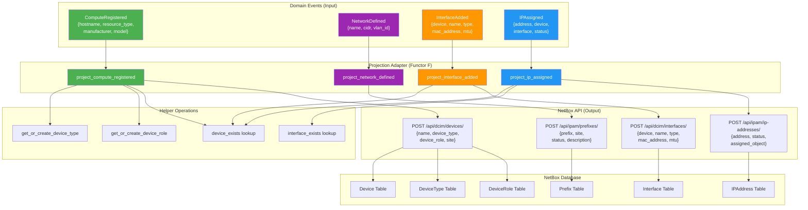

# NetBox Domain Mapping - Visual Summary

## Complete Event-to-API Flow



## Field Mapping Matrix

### 1. ComputeRegistered → Device

```
┌─────────────────────────────────────────────────────────────┐
│ Domain Event                    NetBox API                   │
├─────────────────────────────────────────────────────────────┤
│ event.data.hostname       →     device.name                  │
│ event.data.resource_type  →     device.device_role (lookup)  │
│ event.data.manufacturer   →     device.device_type (lookup)  │
│ event.data.model          →     device.device_type (lookup)  │
│ config.default_site_id    →     device.site                  │
│ event.data.id             →     device.custom_fields.cim_id  │
│ "active"                  →     device.status                │
└─────────────────────────────────────────────────────────────┘

Idempotency Check: GET /api/dcim/devices/?name={hostname}
```

### 2. NetworkDefined → Prefix

```
┌─────────────────────────────────────────────────────────────┐
│ Domain Event                    NetBox API                   │
├─────────────────────────────────────────────────────────────┤
│ event.data.cidr           →     prefix.prefix                │
│ event.data.name           →     prefix.description           │
│ config.default_site_id    →     prefix.site                  │
│ "active"                  →     prefix.status                │
└─────────────────────────────────────────────────────────────┘

Idempotency Check: GET /api/ipam/prefixes/?prefix={cidr}
```

### 3. InterfaceAdded → Interface

```
┌─────────────────────────────────────────────────────────────┐
│ Domain Event                    NetBox API                   │
├─────────────────────────────────────────────────────────────┤
│ event.data.device         →     interface.device (lookup)    │
│ event.data.name           →     interface.name               │
│ event.data.type           →     interface.type               │
│ event.data.mac_address    →     interface.mac_address        │
│ event.data.mtu            →     interface.mtu                │
│ event.data.description    →     interface.description        │
│ true                      →     interface.enabled            │
└─────────────────────────────────────────────────────────────┘

Dependency: Device must exist first
Idempotency Check: GET /api/dcim/interfaces/?device_id={id}&name={name}
```

### 4. IPAssigned → IPAddress

```
┌─────────────────────────────────────────────────────────────┐
│ Domain Event                    NetBox API                   │
├─────────────────────────────────────────────────────────────┤
│ event.data.address        →     ip_address.address           │
│ event.data.status         →     ip_address.status            │
│ event.data.device +       →     ip_address.assigned_object   │
│ event.data.interface      →     (lookup interface ID)        │
│ event.data.description    →     ip_address.description       │
└─────────────────────────────────────────────────────────────┘

Optional Dependency: Interface (for assignment)
Idempotency Check: GET /api/ipam/ip-addresses/?address={address}
```

## Dependency Graph

```
ComputeRegistered                NetworkDefined
       │                                │
       ├─→ Device                       │
       ├─→ DeviceType (auto)            │
       └─→ DeviceRole (auto)            │
       │                                │
       │                           Prefix ←┘
       │
       ↓
InterfaceAdded
       │
       └─→ Interface (requires Device)
            │
            ↓
       IPAssigned
            │
            └─→ IPAddress (optional link to Interface)
```

## Category Theory View

The NetBox adapter implements a Functor `F: Events → NetBox`:

```
Category: InfrastructureEvents
Objects: {ComputeRegistered, NetworkDefined, InterfaceAdded, IPAssigned}
Morphisms: Event composition, causation chains

Category: NetBox
Objects: {Device, Prefix, Interface, IPAddress}
Morphisms: Foreign key relationships, API operations

Functor F: InfrastructureEvents → NetBox
F(ComputeRegistered) = Device
F(NetworkDefined) = Prefix
F(InterfaceAdded) = Interface
F(IPAssigned) = IPAddress

F preserves:
- Identity: F(no-op event) = no-op in NetBox
- Composition: F(event1 ; event2) = F(event1) ; F(event2)
```

## Data Flow Sequence

### Scenario: Register new server with network interface

```
1. ComputeRegistered
   └─→ Check if device "web01.example.com" exists
       └─→ NO: Lookup DeviceType "Dell PowerEdge R750"
           └─→ NOT FOUND: Create DeviceType
               └─→ Lookup DeviceRole "physical_server"
                   └─→ NOT FOUND: Create DeviceRole
                       └─→ POST Device {name, type, role, site}
                           └─→ SUCCESS: Device created with ID 42

2. InterfaceAdded
   └─→ Lookup Device "web01.example.com"
       └─→ FOUND: Device ID 42
           └─→ Check if interface "eth0" exists on device 42
               └─→ NO: POST Interface {device: 42, name: "eth0", ...}
                   └─→ SUCCESS: Interface created with ID 101

3. IPAssigned
   └─→ Check if IP "192.168.1.10/24" exists
       └─→ NO: Lookup Device "web01.example.com"
           └─→ FOUND: Device ID 42
               └─→ Lookup Interface "eth0" on device 42
                   └─→ FOUND: Interface ID 101
                       └─→ POST IPAddress {
                               address: "192.168.1.10/24",
                               assigned_object_type: "dcim.interface",
                               assigned_object_id: 101
                           }
                           └─→ SUCCESS: IP assigned to interface
```

## NetBox UI Verification

After projecting events, verify in NetBox UI:

```
http://10.0.224.131/dcim/devices/
└─→ Find: web01.example.com
    ├─→ Type: Dell PowerEdge R750
    ├─→ Role: physical_server
    ├─→ Status: Active
    └─→ Interfaces:
        └─→ eth0 (1000base-t)
            └─→ IP: 192.168.1.10/24

http://10.0.224.131/ipam/prefixes/
└─→ Find: 192.168.100.0/24
    ├─→ Status: Active
    └─→ Description: CIM Network: DMZ Network
```

## API Authentication

All NetBox API requests include:

```http
Authorization: Token {api_token}
Content-Type: application/json
```

Token configured via `NETBOX_API_TOKEN` environment variable.

## Performance Characteristics

| Operation | API Calls | Avg Latency | Notes |
|-----------|-----------|-------------|-------|
| ComputeRegistered | 1-5 | ~200ms | +2 calls if DeviceType/Role don't exist |
| NetworkDefined | 1-2 | ~100ms | +1 call for idempotency check |
| InterfaceAdded | 2-3 | ~150ms | Device lookup + interface creation |
| IPAssigned | 2-5 | ~200ms | IP check + optional interface lookup |

Bottleneck: Sequential API calls for lookups
Optimization: Batch operations (future enhancement)

## Error Handling Matrix

| Event Type | Error Condition | Adapter Response | NATS Response |
|-----------|-----------------|------------------|---------------|
| ComputeRegistered | Missing hostname | Skip, log error | ACK |
| ComputeRegistered | NetBox API timeout | Retry | NAK |
| InterfaceAdded | Device not found | Skip, log error | ACK |
| InterfaceAdded | Invalid interface type | Skip, log error | TERM |
| IPAssigned | Invalid IP format | Skip, log error | TERM |
| IPAssigned | NetBox unavailable | Retry | NAK |
| Any | Duplicate (idempotency) | Success (no-op) | ACK |
