# Infrastructure Resource Type Taxonomy

**Complete ontology of infrastructure resources in the CIM domain**

## Overview

The `ResourceType` is a domain value object that provides a standardized taxonomy for classifying all infrastructure resources. This taxonomy ensures consistent naming, categorization, and representation across all CIM systems (NetBox, monitoring, documentation, etc.).

## Architecture

```
ResourceType (Value Object with Invariants)
    ├─→ Category (High-level grouping)
    ├─→ Display Name (Human-readable)
    ├─→ Canonical String (Machine-readable)
    ├─→ NetBox Color (Visual categorization)
    └─→ Behavioral Traits (is_network_device, is_compute_resource, etc.)
```

## Complete Taxonomy

### 🟢 Compute Resources

Infrastructure that provides computational capability.

| Resource Type | Canonical String | Display Name | NetBox Color |
|--------------|-----------------|--------------|--------------|
| `PhysicalServer` | `physical_server` | Physical Server | `4caf50` (Green) |
| `VirtualMachine` | `virtual_machine` | Virtual Machine | `4caf50` (Green) |
| `ContainerHost` | `container_host` | Container Host | `4caf50` (Green) |
| `Hypervisor` | `hypervisor` | Hypervisor | `4caf50` (Green) |

**Aliases**:
- `server`, `bare_metal` → `PhysicalServer`
- `vm` → `VirtualMachine`
- `container` → `ContainerHost`
- `host` → `Hypervisor`

### 🔵 Network Infrastructure

Devices that route, switch, or control network traffic.

| Resource Type | Canonical String | Display Name | NetBox Color |
|--------------|-----------------|--------------|--------------|
| `Router` | `router` | Router | `2196f3` (Blue) |
| `Switch` | `switch` | Switch | `2196f3` (Blue) |
| `Layer3Switch` | `layer3_switch` | Layer 3 Switch | `2196f3` (Blue) |
| `AccessPoint` | `access_point` | Access Point | `2196f3` (Blue) |
| `LoadBalancer` | `load_balancer` | Load Balancer | `2196f3` (Blue) |

**Aliases**:
- `l3_switch`, `multilayer_switch` → `Layer3Switch`
- `ap`, `wap` → `AccessPoint`
- `lb`, `balancer` → `LoadBalancer`

### 🔴 Security Appliances

Devices that provide security, access control, or threat protection.

| Resource Type | Canonical String | Display Name | NetBox Color |
|--------------|-----------------|--------------|--------------|
| `Firewall` | `firewall` | Firewall | `f44336` (Red) |
| `IDS` | `ids` | IDS/IPS | `f44336` (Red) |
| `VPNGateway` | `vpn_gateway` | VPN Gateway | `f44336` (Red) |
| `WAF` | `waf` | Web Application Firewall | `f44336` (Red) |

**Aliases**:
- `fw` → `Firewall`
- `ips`, `intrusion_detection` → `IDS`
- `vpn` → `VPNGateway`
- `web_firewall` → `WAF`

### 🟠 Storage Devices

Infrastructure that provides persistent data storage.

| Resource Type | Canonical String | Display Name | NetBox Color |
|--------------|-----------------|--------------|--------------|
| `StorageArray` | `storage_array` | Storage Array | `ff9800` (Orange) |
| `NAS` | `nas` | Network Attached Storage | `ff9800` (Orange) |
| `SANSwitch` | `san_switch` | SAN Switch | `ff9800` (Orange) |

**Aliases**:
- `storage` → `StorageArray`
- `network_storage` → `NAS`
- `san` → `SANSwitch`

### 🟣 Edge/IoT Devices

Edge computing and Internet of Things infrastructure.

| Resource Type | Canonical String | Display Name | NetBox Color |
|--------------|-----------------|--------------|--------------|
| `EdgeDevice` | `edge_device` | Edge Device | `9c27b0` (Purple) |
| `IoTGateway` | `iot_gateway` | IoT Gateway | `9c27b0` (Purple) |
| `Sensor` | `sensor` | Sensor | `9c27b0` (Purple) |

**Aliases**:
- `edge` → `EdgeDevice`
- `iot` → `IoTGateway`

### 🟡 Power/Environmental

Power and environmental monitoring infrastructure.

| Resource Type | Canonical String | Display Name | NetBox Color |
|--------------|-----------------|--------------|--------------|
| `PDU` | `pdu` | Power Distribution Unit | `ffeb3b` (Yellow) |
| `UPS` | `ups` | UPS | `ffeb3b` (Yellow) |
| `EnvironmentalMonitor` | `environmental_monitor` | Environmental Monitor | `ffeb3b` (Yellow) |

**Aliases**:
- `power_distribution` → `PDU`
- `battery` → `UPS`
- `environmental` → `EnvironmentalMonitor`

### 🔵 Telecommunications

Voice and video communication infrastructure.

| Resource Type | Canonical String | Display Name | NetBox Color |
|--------------|-----------------|--------------|--------------|
| `PBX` | `pbx` | PBX/Phone System | `00bcd4` (Cyan) |
| `VideoConference` | `video_conference` | Video Conference System | `00bcd4` (Cyan) |

**Aliases**:
- `phone_system` → `PBX`
- `video`, `conferencing` → `VideoConference`

### 🟤 Appliances

Specialized appliances (general purpose).

| Resource Type | Canonical String | Display Name | NetBox Color |
|--------------|-----------------|--------------|--------------|
| `Appliance` | `appliance` | Appliance | `795548` (Brown) |
| `BackupAppliance` | `backup_appliance` | Backup Appliance | `795548` (Brown) |
| `MonitoringAppliance` | `monitoring_appliance` | Monitoring Appliance | `795548` (Brown) |
| `AuthServer` | `auth_server` | Authentication Server | `795548` (Brown) |

**Aliases**:
- `backup` → `BackupAppliance`
- `monitoring` → `MonitoringAppliance`
- `authentication`, `ldap`, `active_directory` → `AuthServer`

### ⚪ Other/Unknown

Catch-all for uncategorized devices.

| Resource Type | Canonical String | Display Name | NetBox Color |
|--------------|-----------------|--------------|--------------|
| `Other` | `other` | Other | `9e9e9e` (Grey) |
| `Unknown` | `unknown` | Unknown | `9e9e9e` (Grey) |

---

## Usage in Domain Events

### Event Schema

```json
{
  "event_type": "ComputeRegistered",
  "data": {
    "hostname": "core-router-01.example.com",
    "resource_type": "router",  // ← Canonical string from taxonomy
    "manufacturer": "Cisco",
    "model": "ASR 1001-X"
  }
}
```

### Rust Code

```rust
use cim_infrastructure::ResourceType;

// Parse from string (with aliases)
let rt = ResourceType::from_str("router");
assert_eq!(rt, ResourceType::Router);

let rt = ResourceType::from_str("l3_switch");
assert_eq!(rt, ResourceType::Layer3Switch);

// Get properties
assert_eq!(rt.display_name(), "Layer 3 Switch");
assert_eq!(rt.as_str(), "layer3_switch");
assert_eq!(rt.netbox_color(), "2196f3");
assert_eq!(rt.category(), ResourceCategory::Network);

// Check traits
assert!(rt.is_network_device());
assert!(!rt.is_compute_resource());
assert!(!rt.is_security_device());
```

---

## NetBox Projection

When a `ComputeRegistered` event is projected to NetBox:

```
Domain Event                     NetBox Device Role
━━━━━━━━━━━━━━━━━━━━━━━━━━━━━━━━━━━━━━━━━━━━━━━━━━━━━━━━━━━━━
resource_type: "router"    →    name: "Router"
                                slug: "router"
                                color: "2196f3" (Blue)
                                description: "Network - Auto-created from CIM..."

resource_type: "firewall"  →    name: "Firewall"
                                slug: "firewall"
                                color: "f44336" (Red)
                                description: "Security - Auto-created from CIM..."
```

### NetBox UI Organization

Devices will appear in NetBox organized by color-coded roles:

- **🟢 Green Devices** - Compute resources (servers, VMs, etc.)
- **🔵 Blue Devices** - Network infrastructure (routers, switches, etc.)
- **🔴 Red Devices** - Security appliances (firewalls, IDS, etc.)
- **🟠 Orange Devices** - Storage systems
- **🟣 Purple Devices** - Edge/IoT devices
- **🟡 Yellow Devices** - Power/environmental systems
- **🔵 Cyan Devices** - Telecommunications equipment
- **🟤 Brown Devices** - Appliances
- **⚪ Grey Devices** - Other/unknown

---

## Category Relationships

```mermaid
graph TB
    subgraph "Resource Categories"
        C[Compute]
        N[Network]
        S[Security]
        ST[Storage]
        E[Edge/IoT]
        P[Power]
        T[Telecom]
        A[Appliance]
        O[Other]
    end

    subgraph "Compute Resources"
        C --> PS[Physical Server]
        C --> VM[Virtual Machine]
        C --> CH[Container Host]
        C --> HV[Hypervisor]
    end

    subgraph "Network Infrastructure"
        N --> R[Router]
        N --> SW[Switch]
        N --> L3[Layer 3 Switch]
        N --> AP[Access Point]
        N --> LB[Load Balancer]
    end

    subgraph "Security Appliances"
        S --> FW[Firewall]
        S --> IDS[IDS/IPS]
        S --> VPN[VPN Gateway]
        S --> WAF[WAF]
    end

    style C fill:#4caf50,color:#fff
    style N fill:#2196f3,color:#fff
    style S fill:#f44336,color:#fff
    style ST fill:#ff9800,color:#fff
    style E fill:#9c27b0,color:#fff
    style P fill:#ffeb3b,color:#000
    style T fill:#00bcd4,color:#fff
    style A fill:#795548,color:#fff
    style O fill:#9e9e9e,color:#fff
```



---

## Value Object Invariants

The `ResourceType` is an immutable value object with the following invariants:

1. **Canonical Representation**: Each type has exactly one canonical string representation
2. **Unique Display Names**: Each type has a unique human-readable display name
3. **Category Membership**: Each type belongs to exactly one category
4. **Color Assignment**: Each type inherits its category's color (consistent visual identity)
5. **Alias Resolution**: Multiple string representations map to one canonical type

### Invariant Enforcement

```rust
impl ResourceType {
    // Invariant 1: Canonical string is unique and immutable
    pub fn as_str(&self) -> &'static str { /* ... */ }

    // Invariant 2: Display name is unique and immutable
    pub fn display_name(&self) -> &'static str { /* ... */ }

    // Invariant 3: Category membership is deterministic
    pub fn category(&self) -> ResourceCategory { /* ... */ }

    // Invariant 4: Color is derived from category
    pub fn netbox_color(&self) -> &'static str {
        self.category().color()
    }

    // Invariant 5: Parsing resolves aliases to canonical form
    pub fn from_str(s: &str) -> Self {
        // "server", "bare_metal" → PhysicalServer
        // "l3_switch" → Layer3Switch
    }
}
```

---

## Behavioral Traits

Resource types provide behavioral traits for domain logic:

```rust
// Check if device is network infrastructure
if resource_type.is_network_device() {
    // Apply network-specific configuration
}

// Check if device is compute resource
if resource_type.is_compute_resource() {
    // Apply compute-specific monitoring
}

// Check if device is security appliance
if resource_type.is_security_device() {
    // Apply security-specific policies
}
```

---

## Extension Strategy

To add new resource types:

1. Add enum variant to `ResourceType` in `src/domain/resource_type.rs`
2. Implement `as_str()` mapping
3. Implement `display_name()` mapping
4. Assign to appropriate `ResourceCategory` in `category()` method
5. Add alias mappings to `from_str()` method
6. Add tests for new type
7. Update this documentation

### Example: Adding a New Type

```rust
// 1. Add variant
pub enum ResourceType {
    // ... existing variants ...
    /// Time server (NTP)
    TimeServer,
}

// 2. Add canonical string
"time_server" => Self::TimeServer,

// 3. Add display name
Self::TimeServer => "Time Server",

// 4. Assign category
Self::TimeServer => ResourceCategory::Appliance,

// 5. Add aliases
"time_server" | "ntp" | "ntp_server" => Self::TimeServer,
```

---

## Testing

```rust
#[test]
fn test_resource_type_taxonomy() {
    // Test parsing with aliases
    assert_eq!(ResourceType::from_str("router"), ResourceType::Router);
    assert_eq!(ResourceType::from_str("l3_switch"), ResourceType::Layer3Switch);
    assert_eq!(ResourceType::from_str("vm"), ResourceType::VirtualMachine);

    // Test category membership
    assert_eq!(ResourceType::Router.category(), ResourceCategory::Network);
    assert_eq!(ResourceType::Firewall.category(), ResourceCategory::Security);

    // Test behavioral traits
    assert!(ResourceType::Router.is_network_device());
    assert!(ResourceType::PhysicalServer.is_compute_resource());
    assert!(ResourceType::Firewall.is_security_device());

    // Test NetBox color consistency
    assert_eq!(ResourceType::Router.netbox_color(), "2196f3");
    assert_eq!(ResourceType::Switch.netbox_color(), "2196f3");  // Same category, same color
}
```

---

## Implementation Location

- **Module**: `cim-infrastructure/src/domain/resource_type.rs`
- **Lines**: 1-397
- **Exports**: `cim_infrastructure::ResourceType`, `cim_infrastructure::ResourceCategory`
- **Used By**: `NetBoxProjectionAdapter`, event validation, monitoring configuration

---

## See Also

- [NetBox Domain Mapping](./NETBOX_DOMAIN_MAPPING.md) - How ResourceType maps to NetBox
- [NetBox Integration](./NETBOX_INTEGRATION.md) - Complete NetBox integration guide
- [Examples](../examples/netbox_device_types.rs) - Working examples of all device types
