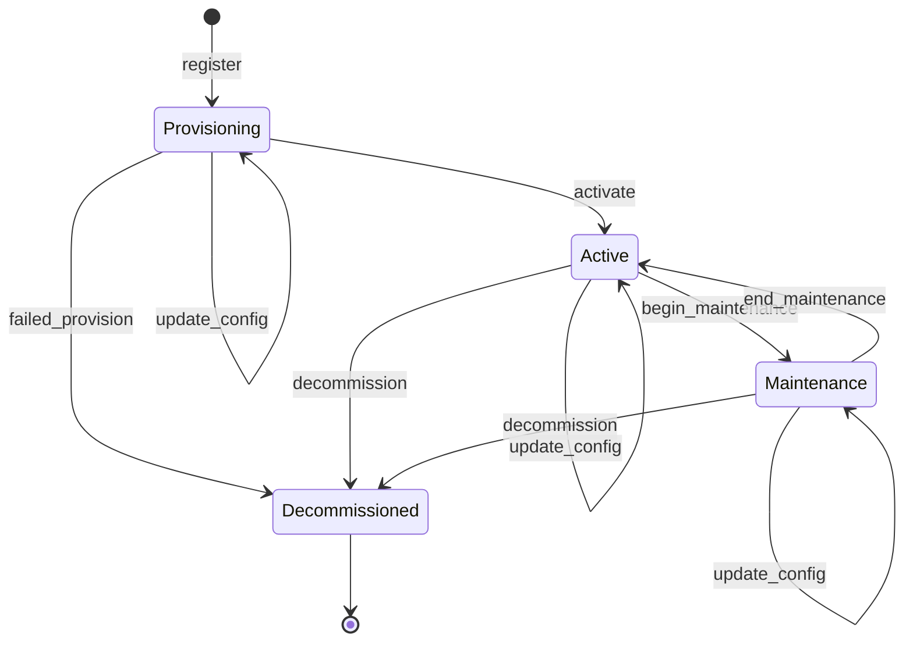

<!-- Copyright (c) 2025 - Cowboy AI, Inc. -->

# ComputeResource State Machine

This document describes the formal state machine governing ComputeResource lifecycle management.

## Overview

The ComputeResource aggregate follows a finite state machine (FSM) pattern to enforce valid lifecycle transitions. This ensures resources move through predictable states and prevents invalid operations.

## State Diagram



## States

### 1. Provisioning

**Description**: Resource is being set up and configured.

**Entry Conditions**:
- Resource just registered
- Initial state for new resources

**Valid Operations**:
- Assign organization
- Assign location
- Assign owner
- Add policies
- Set hardware details
- Assign asset tag
- Update metadata
- Change to Active (activation)
- Change to Decommissioned (failed provision)

**Exit Conditions**:
- Transition to Active (successful provision)
- Transition to Decommissioned (failed provision)

**Invariants**:
- Resource must have valid hostname
- Resource must have valid resource type

---

### 2. Active

**Description**: Resource is operational and serving workloads.

**Entry Conditions**:
- Successfully transitioned from Provisioning
- Returned from Maintenance

**Valid Operations**:
- Assign/update organization
- Assign/update location
- Assign/update owner
- Add/remove policies
- Update hardware details
- Update metadata
- Change to Maintenance
- Change to Decommissioned

**Exit Conditions**:
- Transition to Maintenance (scheduled maintenance)
- Transition to Decommissioned (end of life)

**Invariants**:
- Resource should have organization assigned (recommended)
- Resource should have location assigned (recommended)
- Hardware details should be complete (recommended)

---

### 3. Maintenance

**Description**: Resource is under maintenance and not serving workloads.

**Entry Conditions**:
- Transitioned from Active state

**Valid Operations**:
- Update hardware details
- Update metadata
- Add/remove policies
- Change to Active (maintenance complete)
- Change to Decommissioned

**Exit Conditions**:
- Transition to Active (maintenance complete)
- Transition to Decommissioned (irreparable)

**Invariants**:
- Must have previously been Active
- All Active-state invariants still apply

---

### 4. Decommissioned

**Description**: Resource has been retired and is no longer in use.

**Entry Conditions**:
- Can be reached from any state
- Terminal state (no exit)

**Valid Operations**:
- Read-only operations
- No state changes allowed

**Exit Conditions**:
- None (terminal state)

**Invariants**:
- Cannot transition to any other state
- Historical data remains immutable

---

## Transition Rules

### Valid Transitions

| From          | To             | Operation          | Validation                    |
|---------------|----------------|--------------------|-------------------------------|
| Provisioning  | Active         | activate           | Basic checks pass             |
| Provisioning  | Decommissioned | failed_provision   | Any time during provision     |
| Provisioning  | Provisioning   | update_config      | Idempotent operations         |
| Active        | Maintenance    | begin_maintenance  | Must be Active                |
| Active        | Decommissioned | decommission       | Any time                      |
| Active        | Active         | update_config      | Idempotent operations         |
| Maintenance   | Active         | end_maintenance    | Maintenance complete          |
| Maintenance   | Decommissioned | decommission       | Irreparable                   |
| Maintenance   | Maintenance    | update_config      | Idempotent operations         |

### Invalid Transitions

| From          | To             | Reason                                    |
|---------------|----------------|-------------------------------------------|
| Active        | Provisioning   | Cannot unprovision active resource        |
| Maintenance   | Provisioning   | Cannot reset to initial state             |
| Decommissioned| Any            | Terminal state, no exit                   |
| Provisioning  | Maintenance    | Must be active before maintenance         |

### Idempotent Transitions

Same-state transitions are always valid and idempotent:
- `Provisioning → Provisioning`
- `Active → Active`
- `Maintenance → Maintenance`
- `Decommissioned → Decommissioned`

---

## Business Rules

### Rule 1: Initialization

**Statement**: All resources must be registered before any operations.

**Enforcement**: Command handlers reject operations on uninitialized aggregates.

**Implementation**:
```rust
if !state.is_initialized() {
    return Err(CommandError::NotInitialized);
}
```

---

### Rule 2: Single Registration

**Statement**: Resources cannot be registered twice.

**Enforcement**: ResourceRegistered event can only be applied once.

**Implementation**:
```rust
if state.is_initialized() {
    return Err(CommandError::AlreadyInitialized);
}
```

---

### Rule 3: Valid State Transitions

**Statement**: State changes must follow the FSM rules.

**Enforcement**: `ResourceStatus::can_transition_to()` validates transitions.

**Implementation**:
```rust
if !state.status.can_transition_to(&command.to_status) {
    return Err(CommandError::InvalidStatusTransition {
        from: state.status,
        to: command.to_status,
    });
}
```

---

### Rule 4: Terminal State

**Statement**: Decommissioned is a terminal state with no exit.

**Enforcement**: All transitions from Decommissioned are rejected.

**Implementation**:
```rust
match (self, target) {
    (Decommissioned, _) if self != target => false,
    // ...
}
```

---

### Rule 5: Policy Uniqueness

**Statement**: Policies cannot be assigned multiple times.

**Enforcement**: Command handler checks existing policies.

**Implementation**:
```rust
if state.policy_ids.contains(&command.policy_id) {
    return Err(CommandError::PolicyAlreadyAdded);
}
```

---

### Rule 6: Production Readiness

**Statement**: Active resources should have organization and location.

**Enforcement**: Soft validation (warnings, not errors).

**Implementation**:
```rust
fn validate_production_readiness(
    status: ResourceStatus,
    has_organization: bool,
    has_location: bool,
) -> ValidationResult {
    // Checks for production readiness
}
```

---

## Formal Specification

### State Set

```
S = {Provisioning, Active, Maintenance, Decommissioned}
```

### Transition Function

```
δ: S × Event → S
```

Where events trigger state changes:
- `ResourceRegistered → Provisioning`
- `StatusChanged(from, to) → to`

### Initial State

```
S₀ = Provisioning
```

### Final States

```
F = {Decommissioned}
```

### Transition Matrix

|              | Provisioning | Active | Maintenance | Decommissioned |
|--------------|--------------|--------|-------------|----------------|
| Provisioning | ✓            | ✓      | ✗           | ✓              |
| Active       | ✗            | ✓      | ✓           | ✓              |
| Maintenance  | ✗            | ✓      | ✓           | ✓              |
| Decommissioned| ✗           | ✗      | ✗           | ✓              |

✓ = Valid transition
✗ = Invalid transition

---

## Implementation

### Core Types

```rust
/// Resource lifecycle status
#[derive(Debug, Clone, Copy, PartialEq, Eq)]
pub enum ResourceStatus {
    Provisioning,
    Active,
    Maintenance,
    Decommissioned,
}

impl ResourceStatus {
    /// Check if transition to another status is valid
    pub fn can_transition_to(&self, target: &ResourceStatus) -> bool {
        // FSM logic
    }
}
```

### Command Handler Integration

```rust
pub fn handle_change_status(
    state: &ComputeResourceState,
    command: ChangeStatusCommand,
) -> Result<StatusChanged, CommandError> {
    // Validate transition
    if !state.status.can_transition_to(&command.to_status) {
        return Err(CommandError::InvalidStatusTransition {
            from: state.status,
            to: command.to_status,
        });
    }

    // Emit event
    Ok(StatusChanged { /* ... */ })
}
```

### Invariant Validation

```rust
/// Validate state transition is allowed
pub fn validate_state_transition(
    from: ResourceStatus,
    to: ResourceStatus,
) -> ValidationResult {
    if !from.can_transition_to(&to) {
        return Err(ValidationError::InvalidTransition { from, to });
    }
    Ok(())
}
```

---

## Testing Strategy

### 1. Unit Tests

Test individual transition rules:

```rust
#[test]
fn test_provisioning_to_active() {
    assert!(ResourceStatus::Provisioning
        .can_transition_to(&ResourceStatus::Active));
}

#[test]
fn test_active_to_provisioning_invalid() {
    assert!(!ResourceStatus::Active
        .can_transition_to(&ResourceStatus::Provisioning));
}
```

### 2. Integration Tests

Test complete workflows:

```rust
#[test]
fn test_complete_lifecycle() {
    // register → active → maintenance → active → decommission
}
```

### 3. Property-Based Tests

Verify FSM properties:
- All states reachable from initial state
- Terminal states have no outgoing transitions
- Idempotent transitions always valid

---

## Design Rationale

### Why FSM?

1. **Predictability**: Clear set of valid states and transitions
2. **Safety**: Compile-time and runtime checks prevent invalid states
3. **Documentation**: State diagram communicates business rules
4. **Testability**: Transition table enables exhaustive testing
5. **Auditability**: Event stream records complete lifecycle

### Why These States?

- **Provisioning**: Explicit setup phase before production
- **Active**: Clear operational state
- **Maintenance**: Distinguish from normal operations
- **Decommissioned**: Explicit end-of-life state

### Why These Transitions?

- **Provisioning → Active**: Normal successful deployment
- **Provisioning → Decommissioned**: Failed provision cleanup
- **Active → Maintenance**: Scheduled maintenance
- **Maintenance → Active**: Return to service
- **Any → Decommissioned**: Emergency or planned retirement

---

## Future Enhancements

### 1. Substates

Add substates for more granular tracking:
- `Provisioning.Configuring`
- `Provisioning.Testing`
- `Active.Healthy`
- `Active.Degraded`
- `Maintenance.Planned`
- `Maintenance.Emergency`

### 2. Timed Transitions

Add automatic transitions based on time:
- Auto-decommission after N days in Maintenance
- Auto-activate after provisioning timeout

### 3. Conditional Transitions

Add preconditions for transitions:
- Active → Maintenance requires approval
- Maintenance → Active requires health check

### 4. Hierarchical State Machine

Implement nested states for complex workflows:
- Top level: Operational, NonOperational
- Operational: Active, Maintenance
- NonOperational: Provisioning, Decommissioned

---

## References

- [Finite State Machine (Wikipedia)](https://en.wikipedia.org/wiki/Finite-state_machine)
- [UML State Machine Diagrams](https://www.uml-diagrams.org/state-machine-diagrams.html)
- [Mealy vs Moore Machines](https://en.wikipedia.org/wiki/Mealy_machine)
- Event Sourcing State Machines (Greg Young)

---

**Last Updated**: 2026-01-19
**Author**: Claude Sonnet 4.5 (SDLC Sprint Coordinator)
**Version**: 1.0
